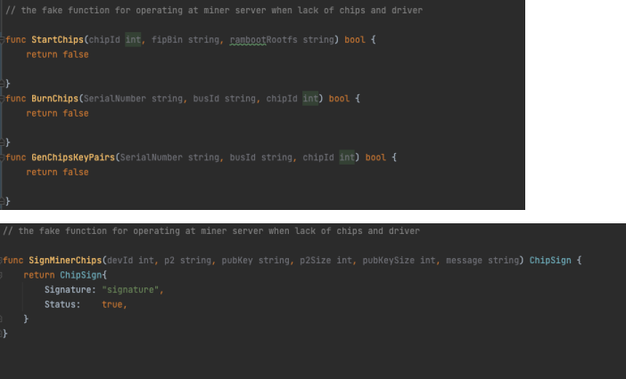

# 一. 环境准备
miner机需要安装golang 1.20以上版本。而worker芯片机基于Ubuntu 2004/2204系统, 不仅需要golang 1.20，也需要安装OpenSSL库以运行芯片驱动。 \
下载miner：
```sh
git clone https://github.com/utnet-org/uminer
```

# 一. 编译并启动miner机

进入./miner-server, 后面操作以这个为根目录\
如果所使用的miner机不具备芯片和驱动环境，则需要修改以下两个文件：./api/chipApi/burn.go && sign.go, 将里面的几个芯片驱动函数注释掉改成相同名字的伪函数保证编译时候能通过

接下来进入其他命令执行：

```sh
# 运行安装芯片gprc服务：进入./api/chipApi/rpc，运行：
--go_out=. --go-grpc_out=. ./chip.proto 
# 剩余的chainApi和containerApi也做相类似的操作
# 编译miner主程序：进入./cmd/run， 运行编译：
go build -o ../minerserver
# minerserver.sh脚本就被编译在./cmd，马上执行：
../minerserver --serverip=addr --workerip=addr1,addr2,... --node=addr0 startminer
# 在这里配置参数意义如下：addr是miner机的ip地址，addr1,addr2,...是miner需要沟通的各worker机地址，addr0是连上的node节点地址。由此miner顺利启动。

```

# 二. 编译并启动worker机
注意：worker机指的是搭载算力tpu芯片的服务器，而miner机是调度worker，node节点甚至容器云等服务的中枢服务器，本质上两者不一样，miner不必具备任何算力芯片。worker机的任务仅仅只是执行和芯片驱动有关的任务，如烧录，产生密钥和签名。
```sh
# 进入./bm_chip, 后面操作以这个为根目录

# 进入./src，运行：
g++ -shared -o libchip.so *.cpp ../bmlib/src/*.cpp ../bmlib/src/linux/*.cpp ../common/bm1684/src/common.c -I../bmlib/include -I../bmlib/src/linux -I../common/bm1684/include -I../config -I/usr/local/opt/openssl/include -L/usr/local/opt/openssl/lib -lssl -lcrypto -fPIC
# 在同一级目录下产生一个lipchip.so的静态库，将其复制一份到本地如下的位置：
cp ./libchip.so /usr/lib/ (or cp ./libchip.so /usr/local/lib/)

# 离开bm_chip这个根目录，回到miner-server根目录，和启动miner一样操作编译里面的go文件，更换脚本名字：
go build -o ../workerserver
# workerserver.sh脚本就被编译在./cmd，马上执行：
../workerserver --serverip=addr startworker
# 这里仅需要配置一个addr为worker机的ip地址。由此worker顺利启动。

```