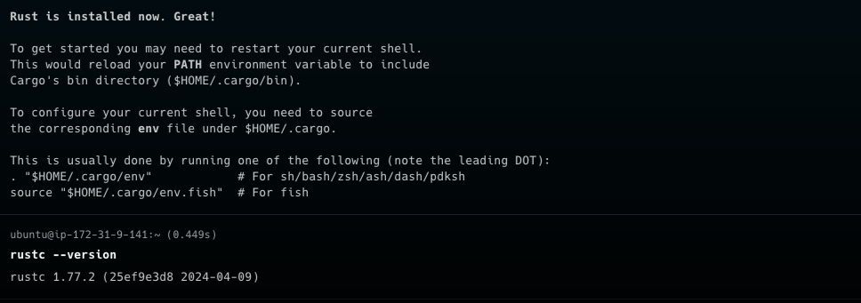
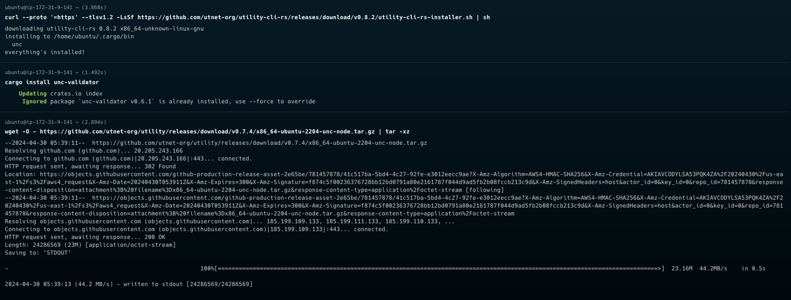
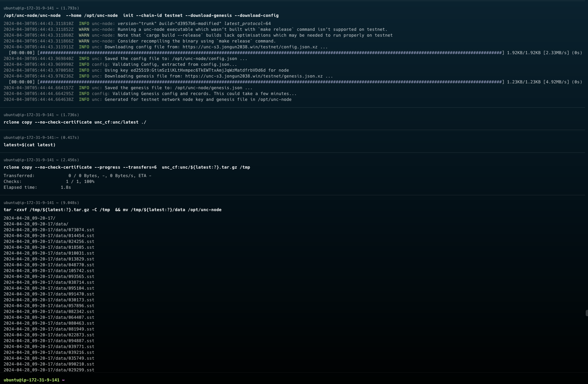
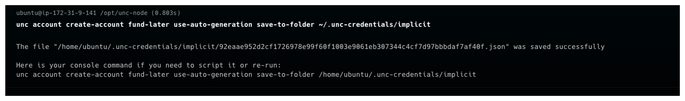
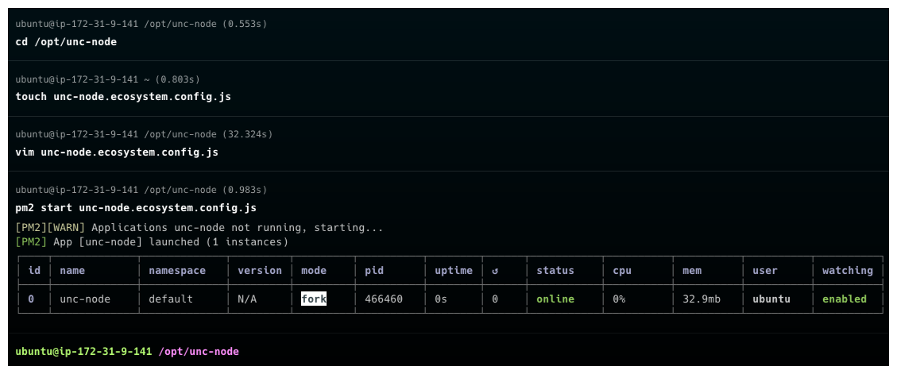
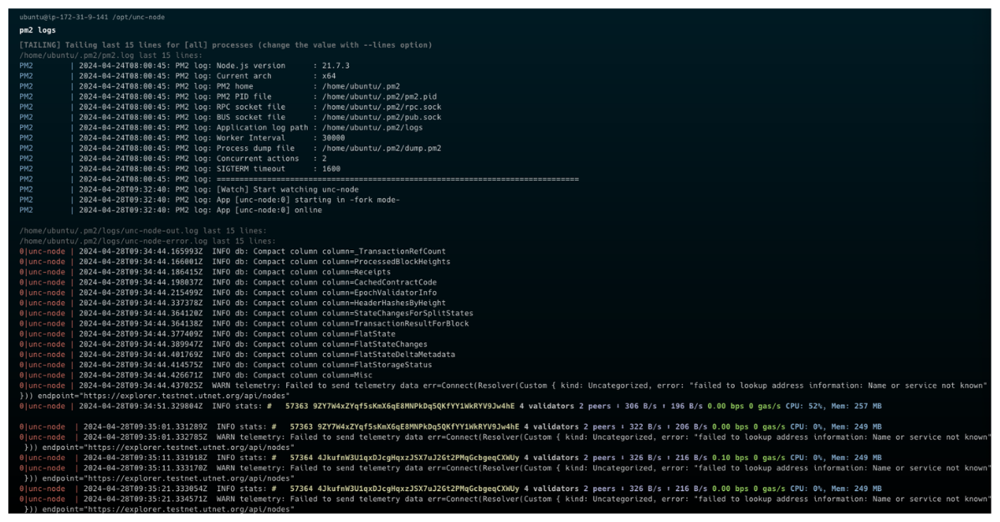

# 一. Environmental preparation

Our nodes are based on Ubuntu 2004/2204 X86-64 system, 16core, 500G minimum configuration. The following operations are all deployed under this system.

## 1. Deploy machines

Deployment related work

```sh

# miner-mach The machine is pre-installed with node.js
# Use curl to download the Node.js 18.x or beyond installation script
curl -sL https://deb.nodesource.com/setup_18.x | sudo -E bash -

# Install Node.js
sudo apt-get install -y nodejs

# Install pm2
npm install -g pm2

# Install rust/cargo
curl https://sh.rustup.rs -sSf | sh
rustc --version

```

we get something like this:



+ Install commonly used system tools: git, curl, wget, build-essential
+ awk/df is generally installed by default. Other tools can be installed using the following commands:

```sh
sudo apt install git curl wget build-essential -y
```

+ Install openssl dependencies

```sh

sudo apt install pkg-config libssl-dev libclang-dev -y
sudo apt-get install --assume-yes libudev-dev
```

+ Install unc-cli 和 unc-node

```sh
# Install unc-cli tool
curl --proto '=https' --tlsv1.2 -LsSf https://github.com/utnet-org/utility-cli-rs/releases/download/v0.12.0/utility-cli-rs-installer.sh | sh

# download unc-node, ex: 2004/2204/2404 pre-binaries
wget -O - https://github.com/utnet-org/utility/releases/download/v0.12.2/x86_64-ubuntu-2004-unc-node.tar.gz | tar -xz

wget -O - https://github.com/utnet-org/utility/releases/download/v0.12.2/x86_64-ubuntu-2204-unc-node.tar.gz | tar -xz

wget -O - https://github.com/utnet-org/utility/releases/download/v0.12.2/x86_64-ubuntu-2404-unc-node.tar.gz | tar -xz


# Unzip the unc-node binary file and place it in /opt/unc-node/, which will be useful later.
sudo mkdir /opt/unc-node
sudo chmod 777 /opt/unc-node
cp unc-node  /opt/unc-node/

```

we get something like this:



## 2. Machine standard configuration

+ Make sure that the version of libc can run the binary program compiled by our rust

```sh
ldd --version
ldd (Ubuntu GLIBC 2.35-0ubuntu3.7) 2.35
Copyright (C) 2022 Free Software Foundation, Inc.
This is free software; see the source for copying conditions.  There is NO
warranty; not even for MERCHANTABILITY or FITNESS FOR A PARTICULAR PURPOSE.
Written by Roland McGrath and Ulrich Drepper.
```

+ Node needs to be installed correctly on the machine (the shell can correctly execute node and npm commands), version 18+

```sh
node -v
v21.7.3
```
  
# 二. Writing configuration files

***This is a key step for new miner nodes***
Create a new description directory below and add the corresponding configuration file in it

```sh

# testnet node init directly use binaries
/opt/unc-node/unc-node  --home /opt/unc-node  init --chain-id testnet --download-genesis --download-config

# download snapshot data （optional）
# install rclone 1.66.0 or beyond
# Linux
$ sudo apt install rclone

$ mkdir -p ~/.config/rclone
$ touch ~/.config/rclone/rclone.conf

# rclone.conf
[unc_cf]
type = s3
provider = Cloudflare
endpoint= https://ec9b597fa02615ca6a0e62b7ff35d0cc.r2.cloudflarestorage.com
access_key_id = 2ff213c3730df215a7cc56e28914092e
secret_access_key = b28609e3869b43339c1267b59cf25aa5deff4097737d3848e1491e0729c3ff6c
acl = public-read

# download data 
$ rclone copy --no-check-certificate unc_cf:unc/latest ./
$ latest=$(cat latest)
$ rclone copy --no-check-certificate --progress --transfers=6  unc_cf:unc/${latest:?}.tar.gz /tmp

# Unzip the snapshot to /opt/unc-node/data
tar -zxvf /tmp/${latest:?}.tar.gz -C /tmp  && mv /tmp/${latest:?}/data /opt/unc-node

```

we get something like this:



# 三. Create an account and transfer money

## Use unc cli to create accounts/transfer/add key operations

```sh
# create new accounts use case, use the account id you created instead of `fd09e7537ee95fd2e7b78ee0a2b10bb9db4ebe65dc94802ce420c94ebb25bc43` in the use case
unc account create-account fund-later use-auto-generation save-to-folder ~/.unc-credentials/implicit
# as follows:
# fd09e7537ee95fd2e7b78ee0a2b10bb9db4ebe65dc94802ce420c94ebb25bc43.json

# Give some funding to the newly created account through the unc foundation account or faucet (pledge requires unc tokens) `fd09e7537ee95fd2e7b78ee0a2b10bb9db4ebe65dc94802ce420c94ebb25bc43`
unc tokens unc send-unc fd09e7537ee95fd2e7b78ee0a2b10bb9db4ebe65dc94802ce420c94ebb25bc43 '100000 unc' network-config testnet sign-with-keychain send

## Execute the `touch validator_key.json` command in the /opt/unc-node directory, and fill in the verifier information from the account created above ~/.unc-credentials/implicit
{
    "account_id": "fd09e7537ee95fd2e7b78ee0a2b10bb9db4ebe65dc94802ce420c94ebb25bc43"
    "public_key":"ed25519:EYM66gAFekoEgLjicPyvZQiFRrbvNsWjVDQQ11fASV3Q",
    "private_key":"ed25519:3NVx4sHxBJciEH2wZoMig8YiMx1Q84Ur2RWTd2GQ7JNfWdyDxwwYrUR6XtJR3YcYeWh9NzVEmsnYe2keB97mVExZ"
}
```

we get something like this:



# 四. Formal deployment of services and configuration

## pre-binaries installation method

## 1. Deployment script

+ The contents of the `unc-node.ecosystem.config.js` file are as follows:
  Among them, the download node path above unc-node

```js
module.exports = {"apps":[{"name":"unc-node","script":"/opt/unc-node/unc-node","env":{"HOME":"/opt/unc-node"},"exec_mode":"fork","watch":"false","autorestart":true,"restart_delay":5000,"cwd":"/opt/unc-node","args":" --home=/opt/unc-node run"}]}
```

we get something like this:



## 2. Service startup and shutdown

```sh
# Running node
pm2 start unc-node.ecosystem.config.js

# Stopping node
pm2 stop unc-node.ecosystem.config.js

# View status
pm2 list

# View log
pm2 logs

# More command or GPT pm2
pm2 --help
```

Check the running status of the service through pm2 list
For example, on miner-mach1, the pm2 list is explicitly as follows:

┌────┬─────────────┬─────────────┬─────────┬─────────┬──────────┬────────┬──────┬───────────┬──────────┬──────────┬──────────┬──────────┐
│ id │ name        │ namespace   │ version │ mode    │ pid      │ uptime │ ↺    │ status    │ cpu      │ mem      │ user     │ watching │
├────┼─────────────┼─────────────┼─────────┼─────────┼──────────┼────────┼──────┼───────────┼──────────┼──────────┼──────────┼──────────┤
│ 0  │ unc-node    │ default     │ N/A     │ fork    │ 466460   │ 91s    │ 0    │ online    │ 0%       │ 154.5mb  │ ubuntu   │ enabled  │
└────┴─────────────┴─────────────┴─────────┴─────────┴──────────┴────────┴──────┴───────────┴──────────┴──────────┴──────────┴──────────

可见这台机器上的unc-node服务都正常启动了，并且运行正常，没有反复重启

通过pm2 logs 确保unc-node服务已经正确启动了,  链同步快照都下载完成或者同步完成, 没有error级别日志, 正常打印区块高度
we get something like this:



## Docker installation method

### Run the image from the command line

```sh
# Set node store location
export UNC_HOME=$HOME/.unc

# Set the node type
export CHAIN_ID=testnet

# Only Set Once Time init node  after `unset INIT`
export INIT=true

docker run \
    -v $HOME/node-store:$UNC_HOME \
    -e CHAIN_ID=$CHAIN_ID \
    -e UNC_HOME=$UNC_HOME \
    -e INIT=$INIT \
    -p 3030:3030 -p 12345:12345 \
    --name unc-node \
    ghcr.io/utnet-org/utility:latest
```

Or

### docker-compose.yml

```yaml
version: "3.8"
services:
  unc-node:
    image: ghcr.io/utnet-org/utility:latest
    environment:
      - UNC_HOME=$HOME/.unc
      - CHAIN_ID=testnet
      - INIT=true
    volumes:
      - ${HOME}/node-store:$HOME/.unc
    ports:
      - 3030:3030
      - 12345:12345
```

```sh
# view services
docker-compose up -d
docker ps
docker logs -f unc-node
docker exec -it <container-id> /bin/bash
```

## 3. Initiate pledge (provided there is an account with token)

```sh
# Directly initiate pledge, 100K unc
unc pledging directly pledge-proposal fd09e7537ee95fd2e7b78ee0a2b10bb9db4ebe65dc94802ce420c94ebb25bc43 ed25519:EYM66gAFekoEgLjicPyvZQiFRrbvNsWjVDQQ11fASV3Q '100000 UNC' network-config testnet sign-with-keychain send

# Check the direct pledge amount
unc pledging directly view-pledge fd09e7537ee95fd2e7b78ee0a2b10bb9db4ebe65dc94802ce420c94ebb25bc43 network-config testnet now

# view tx status View tx status value Success is required
unc transaction view-status EWHzhriCRTbDVd9SH6Vk88hSHqzJ7pipXW6eUhWTBkvS network-config testnet

```

## 4.Register miners to upload to the chain (only the foundation has the authority to operate)

```sh
## Use the foundation account unc to register Rsa2048 keys, ***batch_register.json.sample is the miner rsa keys file, unc.json is the foundation unc account keys file***
unc extensions register-rsa-keys unc use-file ~/keys/batch_register.json.sample with-init-call network-config custom sign-with-access-key-file ~/.unc-credentials/unc.json send
```

## Add rsa public key to the validator account, such as `fd09e7537ee95fd2e7b78ee0a2b10bb9db4ebe65dc94802ce420c94ebb25bc43`

```sh
unc account add-key fd09e7537ee95fd2e7b78ee0a2b10bb9db4ebe65dc94802ce420c94ebb25bc43 grant-full-access use-manually-provided-public-key rsa2048:2TuPVgMCHJy5atawrsADEzjP7MCVbyyCA89UW6Wvjp9HrAzK4ZdyEHxs7qVnPrrF3R6w3zNJoHz828bNNJq9f6FPqyq9hsRP47qNXu1mcxeqWmRr8TKTBMLQNzNcjZVm6qX2BiSdXetAZsjPBMC6TyC2smee4s5Mqc4uh5rc5v7Z6nHWGxttHbhHGUCyWtgNGgPevFB2odsTdaXgcgWKtR3zLD6qrbaw631yNEJhverkLMrQJz436L21JWkgXpcTDRYPNWnk7DbztgA6RcgLmve3EG125eW2c2Bj7DkkWAVeWHZnXboDM8kYhAEbfRqUuKwn9K1m9adMqfig4xmM5wxGGABu5dD1gmthQRytLF1y3o2kpTtgrsNyBVTkqV7eMR9qJhUxwiU1rXdQKJ network-config testnet sign-with-keychain send
```

## 5.Initiate on-chain challenges (miners receive computing power and initiate challenges periodically)

```sh
# ***challenge.json.sample is the challenge information, rsa_signer_key.json is the rsa keys file, this is simulated, the real one must be initiated by the computing machine***
unc extensions create-challenge-rsa fd09e7537ee95fd2e7b78ee0a2b10bb9db4ebe65dc94802ce420c94ebb25bc43 use-file ~/keys/challenge.json.sample without-init-call network-config custom sign-with-access-key-file ~/keys/rsa_signer_key.json send

```

+ batch_register.json.sample Register miner configuration information, the field `power` default unit is Tera which is 10.pow(12)

```json
[
    {
    "miner_id": "miner0",
    "public_key": "rsa2048:2TuPVgMCHJy5atawrsADEzjP7MCVbyyCA89UW6Wvjp9HrAzK4ZdyEHxs7qVnPrrF3R6w3zNJoHz828bNNJq9f6FPqyq9hsRP47qNXu1mcxeqWmRr8TKTBMLQNzNcjZVm6qX2BiSdXetAZsjPBMC6TyC2smee4s5Mqc4uh5rc5v7Z6nHWGxttHbhHGUCyWtgNGgPevFB2odsTdaXgcgWKtR3zLD6qrbaw631yNEJhverkLMrQJz436L21JWkgXpcTDRYPNWnk7DbztgA6RcgLmve3EG125eW2c2Bj7DkkWAVeWHZnXboDM8kYhAEbfRqUuKwn9K1m9adMqfig4xmM5wxGGABu5dD1gmthQRytLF1y3o2kpTtgrsNyBVTkqV7eMR9qJhUxwiU1rXdQKJ",
    "power": 100,
    "sn": "serial number here c0",
    "bus_id": "bus info c0",
    "p2key": "p2keys1 c0"
    },
    {
    "miner_id": "miner1",
    "public_key": "rsa2048:2TuPVgMCHJy5atawrsADEzjP7MCVbyyCA89UW6Wvjp9HrCGrtsUG9dcY8iaDtbnNTuA8PiVhpLgeiznHF3SUjAdYk4bSnwTShu5oNY5o3z1LYcgjiZhAoVi4Wh1MmZUqPSecUAMRAdUkXtjk9c2g33xxvVWA7Bc9d4E2hJjzxPoyBWSvYAebNQahxNk3Pio942Gy9kaX79j2evzNLuNvNPpc8ajwBcSbaufWMe3FYfbX8tVsdUA9AhYem36a2U3SNZQtxVF4pGBp9pz327w9debh4hf8jzSHoffh4oxGrC4peAEeJFjdR6rnSPFdzvF1o6gWF1EFqdz1ksWCaYyAgapk2WNPU9i9JK66XqW9xyaikrojcX7oZLnMCKi51k1mr7AefJzjh4iUoJ5SHn",
    "power": 200,
    "sn": "serial number here c1",
    "bus_id": "bus info c1",
    "p2key": "p2keys1 c1"
    },
    {
    "miner_id": "miner2",
    "public_key": "rsa2048:2TuPVgMCHJy5atawrsADEzjP7MCVbyyCA89UW6Wvjp9HrBcvkfoM33uFehzP1wtSX7XwvCGhTPQdjjitsZ9zjbLVqLEnuZVYjZmArhJLFJrukpXxo7yVQBn3BH8bZVR5NBWmnRwvSGThyVgKssvQ2m6uLC9PDM4b7VcyJZGoZrrgTU75e851CcxconxvQZ7CZjbpcZ2N3rv7nzWceUKZUfgqoDyEmwsxM44LeB6Z3Rhfe2gHyZSm2JZj2HeyvyEa23dvehUPvZ8ZpUnsR8mRJThBUWSfPjiX5yX97584h6FEh4W3YAu9AFsmvLQULsYAtmTe6SxWSa8GdBizE5tUW5SfU73cF6Gu1FG8uaNeXCXiR8cEsMPjhmJuwuMYdHsAQbVWzWgsXMgyVFtwep",
    "power": 300,
    "sn": "serial number here c2",
    "bus_id": "bus info c2",
    "p2key": "p2keys1 c2"
    }
]
```

+ challenge.json.sample Activate computing power and initiate challenge configuration information

```json
{
    "public_key": "rsa2048:2TuPVgMCHJy5atawrsADEzjP7MCVbyyCA89UW6Wvjp9HrAzK4ZdyEHxs7qVnPrrF3R6w3zNJoHz828bNNJq9f6FPqyq9hsRP47qNXu1mcxeqWmRr8TKTBMLQNzNcjZVm6qX2BiSdXetAZsjPBMC6TyC2smee4s5Mqc4uh5rc5v7Z6nHWGxttHbhHGUCyWtgNGgPevFB2odsTdaXgcgWKtR3zLD6qrbaw631yNEJhverkLMrQJz436L21JWkgXpcTDRYPNWnk7DbztgA6RcgLmve3EG125eW2c2Bj7DkkWAVeWHZnXboDM8kYhAEbfRqUuKwn9K1m9adMqfig4xmM5wxGGABu5dD1gmthQRytLF1y3o2kpTtgrsNyBVTkqV7eMR9qJhUxwiU1rXdQKJ",
    "challenge_key": "ed25519:8FhzmFG24qXxJ9BJLHTxwhxYY4yu4NV8YPxtksmC86Nv"
}
```

+ rsa_signer_key.json The challenge is initiated using the rsa2048 keys signature file

```json
{
  "account_id": "miner-test1",
  "public_key": "rsa2048:2TuPVgMCHJy5atawrsADEzjP7MCVbyyCA89UW6Wvjp9HrBWvq7Yc23gLm9CXF1USvSSR13bqqCKpu5cmWrvC7Ebn5uETJnePKEyG3RhQt8WFayJ1KnsaGa6ZBQDKd9MwFqqwaC6KXpCpTRKWho4NgXVhnCDLRjWehS7gKntWjH42Q1TMRLpWAkMtcAbqEJ2B4HjFiyWFQyHwGyvFYv8SkYKBPLgHy8bSvqJzbwB9C5HLqCbeEurmPV9r7MmBG6BZkpVbyYhJRaurf3RkdpEHJMtvy2WG8YWqbtxjGzkGeu2mC4xj4xGBonYgAVkoXp92TRLg4i3Te8weJnzT74YkzYFdQ7SnjJHPJF156W9o5HX67kqdfFqas6yqxnnVSMkw5o6JQr9iG5mxqy1QLx",
  "private_key": "rsa2048:riiewRJm2wpE3rWTs1ikUc83so8ZXMX8vp9dUTnRgMC8GyfLr99MDwLmsGXjCMrdNrZBdvRZERvZ9HjFTHCqb6cGi4dEV7vcQwJND4Rd4CzHzaYc3WUC25Dmfp6HJM8usxH2mzqfZsvfMgNcPW6n2ESQ44yEkqsetwvn6pAiKgVHEmaY2fa3HEoET8gNjGbpuATRtx5J3nhVf8Wk7v4UFbH5Z234C76rU3bKFXeeLYNDTnqDAjT6LNbRJsdPbMoQfHArmbv3AKzk3QAKwcyq1sxysUtx8uzb4feJ5EjXCR9RyBG27dTwbXfJNruKu49SYCd3Did5ae1bWMGhxzUrXXb7RZq9hikJCmmQLNGX7r5PrSenztiKTqhQxGKpMoHZp7RvReuK8czMidSeJy9EWWXGWrJL5ANN14YguDMpcEf5Db6e3XCJvt3iKfxCjx7pmoSUarqZg4EkXkCMhhkz38f9L6Pedb45RQFZejrWreM5Bh3v1nEWAtUPZY9y4z3jY4ppGP1YBkqLnwc5psZ5bgAVkeRbsWvWA871L2gNXhg5ecPJBQiU8BJDtwEZnyGUBSaSYESQPSwrtzwCxj7FgrxsuJeXamFppgH7C6tisybaaP9M9159ZRFZUjZFwRfWR8ZocxVkHDgBJE7s2hDoMxZxufVxCFeuKzmw7EDmq3AKmLXw7FpUXKwL13NcatuVj2yqiemNchdqwi5Ro51Bp2kv4nGpCWYknRT66KzCGG1DdCJxXpgBpi6q75jx6KeUwpQQKK2AvNm4283M3gaJ4Tnqv4Gzh1tQ5Jt4pK94EYwMSgy62V2bshBRVxTXAzECWkxxmuYtm9ahRMr1mqZi1AfQoswxhAVYvB2g59ZdKs4tSiBtsQZVT7emC5mo7XEFdVqBpcA7wYHKnQ15sevbDyVyt3PsM2Gx4tVKYHUhyA85kUdX8UwGGscXDsEdvdD22QQNSspvBNYBd2XUXv7EimAx11ncxMa9RaCHpizrSV7aSnVHY1GEJD6Y22K1V8jqj54m3h17LRUaHw6Liv2QrqKq5BpyP4rK5SX8H19u76qjZRztkUG4qRX16YhrHTg7KgpMZxpVGCHHce5qKTcKeRHHsyYE1Jzkdp5K8yCFKwtAWUaZeoaqJBWhpxTzBucDrwCzfyVpSNXhkx9W8tmKfW45HNNpD5wAXWoDdJPqJrAMahC2cPthKhkZQfND5WTiiWtRFroVqoAyTbVdMUxvTJUKS1r9CDCFgoJFRPnndz2fbdSSabLMcCasyV7Aq6X2ckVQW4Mq69GJHTyokyWHA7d9nmPQCACdSTtAbnPtdeG4tXmSYqELtCL43hLLx8m2MrDWdFgrpkXjEWdPS8p9QEuv86opKxiU3MjYgBF9oUfdSV4nmbDFR7H1LQ5sKcCxg7Z515VSCVwCKbRgtvtcUV6hmmKu7HBVmyiNEpjy3EWPM2GmPC84qs2wm3j2tamnXgKU9ZtiPpD5KAueYURbxurempUUcBwyLmSiHdfrGiiBZw8FkZRFuAqooa2QxNRzNXEmVGKRVDunUhDi2S4cues452T1tdqpMvtvBwd3EjfT6yNxtSu6o8fjnJqSHRt6JrKQRPagdN7mfV5Rs1zZDv5oaKXUwEwSeyx9pwQoPMPacEkMJ4Ap5pVGdDT8bZn"
}
```

## Various types of keys generation tools `keypair-generator`

### Generate various keys for signer validator node

```bash
# prepare
git clone https://github.com/utnet-org/utility.git
cd utility

# rsa keys
cargo run --package keypair-generator --bin keypair-generator -- --home=~/keys  --account-id=miner0 --generate-config  signer-keys --key-type=2 --num-keys=4

# signer key
cargo run --package keypair-generator --bin keypair-generator -- --home=~/keys  --account-id=miner0 --generate-config  signer-keys --key-type=0 --num-keys=1

# node key
cargo run --package keypair-generator --bin keypair-generator -- --home=~/keys  --account-id=miner0 --generate-config  node-key

# validator key (a.k.a Create a wallet with keypair-generator)
cargo run --package keypair-generator --bin keypair-generator -- --home=~/keys  --account-id=miner0 --generate-config  validator-key
```

At this point, the node has been cold started. You can use unc related tools to perform account related operations, and use pm2 to monitor the node.
